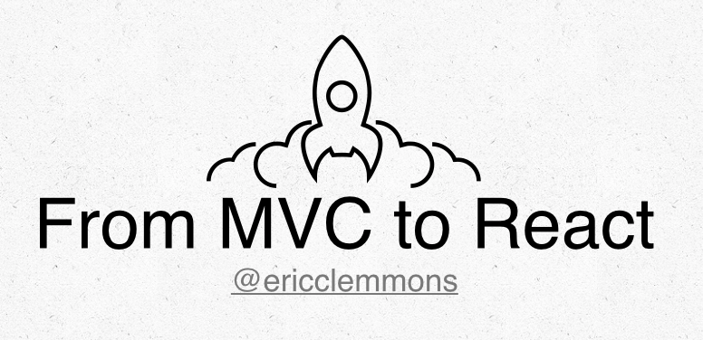

# Moving from MVC to React

> [](http://www.slideshare.net/ericclemmons/from-mvc-to-react)
> – Eric Clemmons @ [Space City JS 2015](http://spacecityjs.com/)

This project has [step-by-step commits][commits] introducing the following
concepts in [React][react]:

- Running [React][react] on the server.
- Rendering a simple `<Component />`.
- Passing `props` into a `<Component />`.
- Rendering [React][react] on the client.
- Serializing data on the server & using it on the client.
- Using `context` to pass data to deeply-nested children.
- Simple testing using [Mocha][mocha]


## Dependencies

- [Node](https://nodejs.org/)
- [nvm](https://github.com/creationix/nvm)


## Installation

After cloning/download this project:

```shell
$ nvm install
$ nvm use
$ npm install
```

Now that the correct version of Node & NPM dependencies are installed:

```shell
$ npm start
```

Open the project in your editor, then go to the following URLs and see
how it all works:

- <http://localhost:3000>
- <http://localhost:3000/foo>
- etc.


## Resources

These are from the final slide.

- Learning
  + <http://facebook.github.io/react/>
  + <http://conf.reactjs.com/schedule.html>
  + <https://www.tildedave.com/2014/11/15/introduction-to-contexts-in-react-js.html>
  + <https://github.com/ericclemmons/mvc-to-react>

- Getting Started
  + <https://github.com/RickWong/react-isomorphic-starterkit>
  + <https://github.com/rackt/react-router/>

- Other Environments
  + <https://github.com/reactjs/react-rails>
  + <https://github.com/reactjs/React.NET>
  + <https://github.com/reactjs/react-python>
  + <https://github.com/reactjs/react-php-v8js>

- Flux Implementations
  + <http://goatslacker.github.io/alt/>
  + <https://github.com/acdlite/flummox/>
  + <https://facebook.github.io/flux/>
  + <http://fluxible.io/>
  + <http://martyjs.org/>
  + <https://github.com/spoike/refluxjs/>

- Community
  + <http://reactiflux.com/>


[commits]: https://github.com/ericclemmons/mvc-to-react/commits/master
[mocha]: http://mochajs.org/
[react]: http://facebook.github.io/react/
